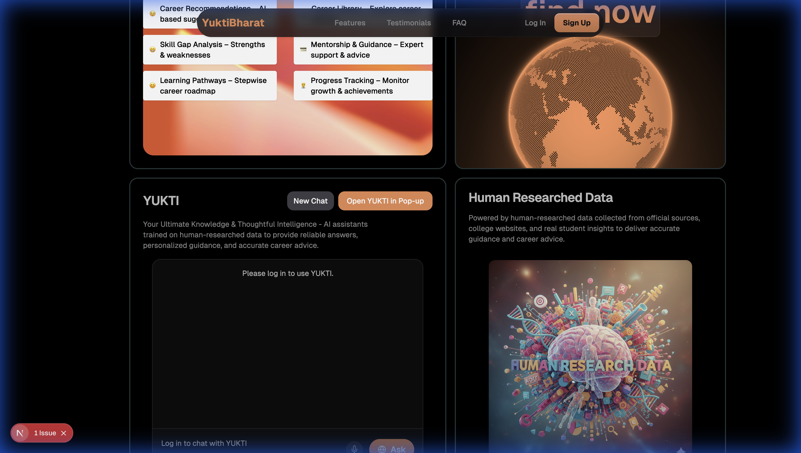

# YuktiBharat

**An interactive platform that helps students discover their passions and choose the right career path through smart quizzes and personalized guidance.**

YuktiBharat is a Next.js-based web application designed to empower students with career discovery tools. It features a modern, responsive UI with a dark-themed aesthetic, secure authentication via Supabase, and interactive components.

## Features

-   **Smart Career Guidance**: Tools and quizzes to help students find their path.
-   **Modern User Interface**: A sleek, dark-mode design with "Pearl Mist" background effects.
-   **Secure Authentication**: User sign-up and login powered by **Supabase**.
-   **Interactive Components**:
    -   **Hero Section**: Engaging landing area.
    -   **Features & Testimonials**: Showcasing platform capabilities and user success stories.
    -   **FAQ Section**: Addressing common user queries.
    -   **New Release Promo**: highlighting updates.
    -   **Mobile Responsive**: Fully functional mobile navigation and layout.

## Technology Stack

-   **Framework**: [Next.js 15](https://nextjs.org/) (App Router)
-   **Language**: [TypeScript](https://www.typescriptlang.org/)
-   **Styling**: [Tailwind CSS 4](https://tailwindcss.com/)
-   **Authentication & Backend**: [Supabase](https://supabase.com/)
-   **UI Components**: [Radix UI](https://www.radix-ui.com/), [Lucide React](https://lucide.dev/) (Icons)
-   **Animations**: [Framer Motion](https://www.framer.com/motion/), [Tw-animate-css](https://www.npmjs.com/package/tw-animate-css)
-   **Optimization**: `next/font` (Geist font family), `next/image`

## Screenshots

<div align="center">
  <h3>Home Page</h3>
  
  
  <h3>Features Section</h3>
  
</div>


## Getting Started

### Prerequisites

-   Node.js (v18+ recommended)
-   npm, yarn, pnpm, or bun

### Installation

1.  Clone the repository:
    ```bash
    git clone <repository-url>
    cd YuktiBharat
    ```

2.  Install dependencies:
    ```bash
    npm install
    # or
    yarn install
    # or
    pnpm install
    ```

3.  **Configuration**:
    Currently, Supabase credentials are configured in `lib/supabaseClient.tsx`. Ensure you have the correct access or update this file with your project's credentials if you are forking.

4.  Run the development server:
    ```bash
    npm run dev
    # or
    yarn dev
    # or
    pnpm dev
    ```

5.  Open [http://localhost:3000](http://localhost:3000) with your browser to see the result.

## Project Structure

-   `app/`: Application routes and pages (App Router).
-   `components/`: Reusable UI components (Hero, Features, etc.).
-   `lib/`: Utility functions and Supabase client configuration.
-   `public/`: Static assets.

## Learn More

To learn more about the technologies used:

-   [Next.js Documentation](https://nextjs.org/docs)
-   [Supabase Documentation](https://supabase.com/docs)
-   [Tailwind CSS Documentation](https://tailwindcss.com/docs)
